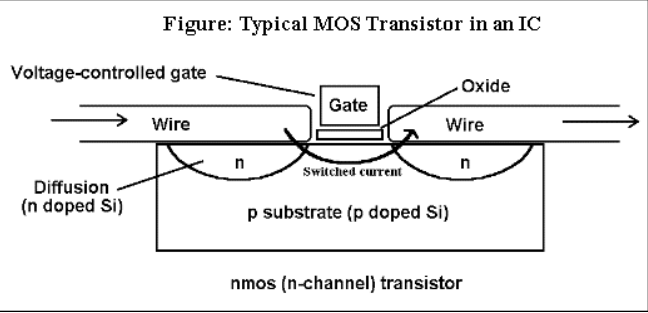
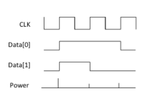
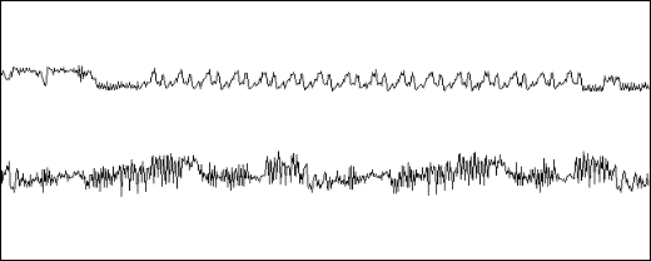

# Power Monitoring Attack

Power Monitoring is a Side Channel attack is based on the power consumptions of cryptographic devices. Capturing data is as simple as monitoring power consumption while a cryptographic or critical operation is being performed.  

## Power Variation

Integrated Circuits are built using Transistors which act as switches controlled by voltage. Current flows across the transistor when charge is applied to/removed from the transistor. This leads to a flow of current from this transistor to other transistors, wires among other electrical components. This movement of current consumes power and emits electromagnetic radiation which can be observed externally.

As microprocessers have regular transistor switching actions, the change in power consumption can be analysed to identify activity.

## Simple Power Analysis (SPA)

In SPA, attacker directly observes power consumption over a period of time. Different operations draw different amounts of power. Using this, one can distinguish what operations are being executed at a particular instance in time. For example, multiplication and addition can be identified separately as multiplication draws more power than addition. In addition, during reading of data, the ratio of 1s when compared to 0s will be reflected in the power consumption. 

The above graph is a simplified graph of SPA.

Large features and operations such as DES Rounds and RSA operations can be identified as they have the operations performed during various stages of these vary to a large extent.

SPA can be used to break RSA by looking at the difference in power consumption during multiplication and addition as stated earlier. It can also be used to break DES due to visible differences in power consumption during permutations and shifts.

The above figure represents power consumption during DES.
The **upper curve** represents the **entire encryption process**, including initial permutation, 16 rounds and the final permutation.
The **lower curve** represents the **second and third rounds** of the encryption process.

It is not practical when there is a lot of noise in the power consumption. In addition, it is very easy to prevent a SPA-resistant device as well.

## Dynamic Power Analysis (DPA)

