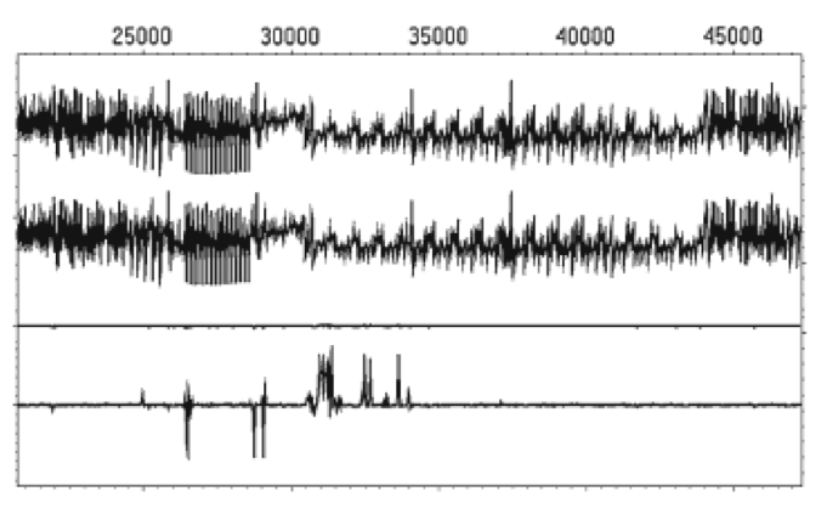
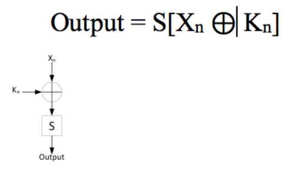
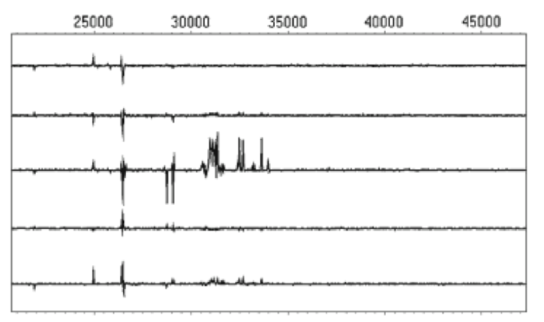

# Power Monitoring Attack

Power Monitoring is a Side Channel attack is based on the power consumptions of cryptographic devices. Capturing data is as simple as monitoring power consumption while a cryptographic or critical operation is being performed.  

## Power Variation

Integrated Circuits are built using Transistors which act as switches controlled by voltage. Current flows across the transistor when charge is applied to/removed from the transistor. This leads to a flow of current from this transistor to other transistors, wires among other electrical components. This movement of current consumes power and emits electromagnetic radiation which can be observed externally.

As microprocessers have regular transistor switching actions, the change in power consumption can be analysed to identify activity.

## Simple Power Analysis (SPA)

In SPA, attacker directly observes power consumption over a period of time. Different operations draw different amounts of power. Using this, one can distinguish what operations are being executed at a particular instance in time. For example, multiplication and addition can be identified separately as multiplication draws more power than addition. In addition, during reading of data, the ratio of 1s when compared to 0s will be reflected in the power consumption. 

The above graph is a simplified graph of SPA.

Large features and operations such as DES Rounds and RSA operations can be identified as they have the operations performed during various stages of these vary to a large extent.

SPA can be used to break RSA by looking at the difference in power consumption during multiplication and addition as stated earlier. It can also be used to break DES due to visible differences in power consumption during permutations and shifts.

The above figure represents power consumption during DES.
The **upper curve** represents the **entire encryption process**, including initial permutation, 16 rounds and the final permutation.
The **lower curve** represents the **second and third rounds** of the encryption process.

It is not practical when there is a lot of noise in the power consumption. In addition, it is very easy to prevent a SPA-resistant device as well.

## Differential Power Analysis (DPA)

It is a statistical method to apply data-dependent correlations and is much more powerful than SPA, and as a result, much more difficult to prevent.

There are two major phases to DPA:

- **Data Collection**: Sampling a device's power consumption while executing cryptographic operations as a function of time.
- **Data Analysis**: Analysing the collected data to find correlations between cryptographic operations and power consumption.

This approach takes multiple traces of two sets of data. Now one must compute the difference between the average of these traces. If this value is zero, there is no correlation. If the difference is non-zero, these sets of data are correlated. Even tiny correlations can be seen given enough traces as noise in a system is eliminated during the averaging.

The average of two sets of traces in DPA are shown on the first two lines of the above picture. The difference of those two traces is shown in the third line. The trace on the fourth line is the same but magnified by a factor of 15. There is a clear non-zero value being shown in the fourth line and hence it can be inferred that these two straces are correlated. If there was no correlation, the difference would be zero or close to zero.

#### Application of DPA to break AES

The above picture contains the equation of AES where `S` is a look-up table, which is used on the XOR of a known input Xn and an encryption key Kn. To determine Kn, several guesses are made.  
The first set of traces fall into the set where LSB of Output is 0. The second set of traces fall into the set where LSB of Output is 1. As stated earlier, the difference of the average of the two traces is computed and examined. In the below figure, there are traces of five different Kn values.

The correct key is in the **third** trace. As the encryption key is usually a 128-bit value, the number of attempts to test every single value would be 2128. This key can be broken into `16-bit` blocks where each byte can be solved individually. It will take only 16 * 256 attempts or 4096 attempts to break the entire key.

## Countermeasures

#### SPA

SPA can be prevented by just adding noise to the system. In addition, one can also perform random operations to obscure the power consumption done by other operations. The design should **not** have conditional branches.

#### DPA

Preventing DPA is much more challenging. A few common methods are:

- Decrease the **signal-to-noise** ratio. Lower the ratio, greater the number of traces required to perform the attack. Adding random wait states and dummy operations also helps.
- Balancing the amount of power used for given data value or operation. Balancing power consumption will result in reducing the amplitude of trace, making detecting correlations that much harder.
- The **most effective** and **least difficult** way to prevent side-channel attacks is to limit the number of transactions that can be performed with a particular key, like a password timeout.